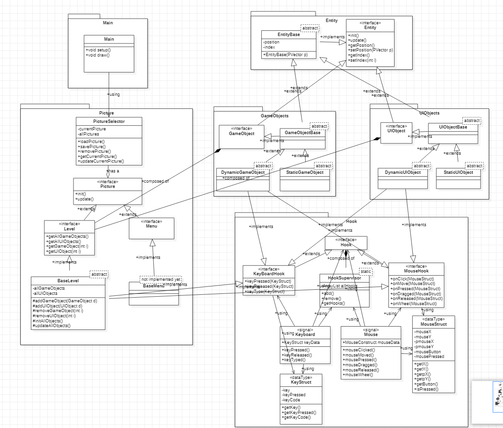

# SimpleEngine
A simple game engine in processing that allows the user to create custom objects. Built with the intention of exercising the SOLID principles of OOP. Sparked by reading Clean Architecture by Robert C. Martin.

### Usage

Run Main to load game.

Create Custom Levels, GameObjects, UIObjects in the "CreatedX" files. Custom classes are already there which can be used as guide for the various objects.

### Basic Overview of Components

PictureSelector selects Pictures in Main -> Pictures are either Level or Menu -> Levels are composed of GameObjects and UIObjects, Menus are only UIObjects -> Custom levels derive from BasicLevel -> Create GameObjects and UIObjects within Level class. Use Hooks to have them interact with the user. Use the class itself to have them interface with eachother.

IN GENERAL: MAIN -> PICTURE -> LEVELS & MENUS (HOOKS) -> GAMEOBJECTS & UIOBJECTS (HOOKS/ENTITIES)

### UML Diagram

